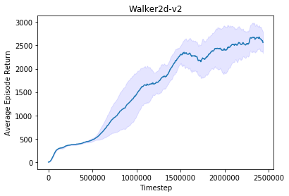

# A minimal implementation of PPO in Pytorch 1.0 for continuous control

The implementation details are discussed [here](https://drive.google.com/file/d/1mjLKiPya9qSH9WuIO769fFGxgaTZT_qK/view?usp=sharing) and [here](https://drive.google.com/file/d/1cWHWENpqBt9kgHoz5OlkH6bgMMhjnSBg/view?usp=sharing).

### Performance

  

  

  

### Usage

The results can be reproduced exactly by running:
```
./run_experiments.sh
```

Experiments on single environments can be run by calling:
```
python main.py --env HalfCheetah-v2 --seed 0
```

Script to visualize trained results are in ```plotter.ipynb```

### Dependencies

Main Requirements:

- Pytorch 1.0

- OpenAI Gym

- Mujoco 150

More information about package requirements can be found in the conda `environment.yml` file
